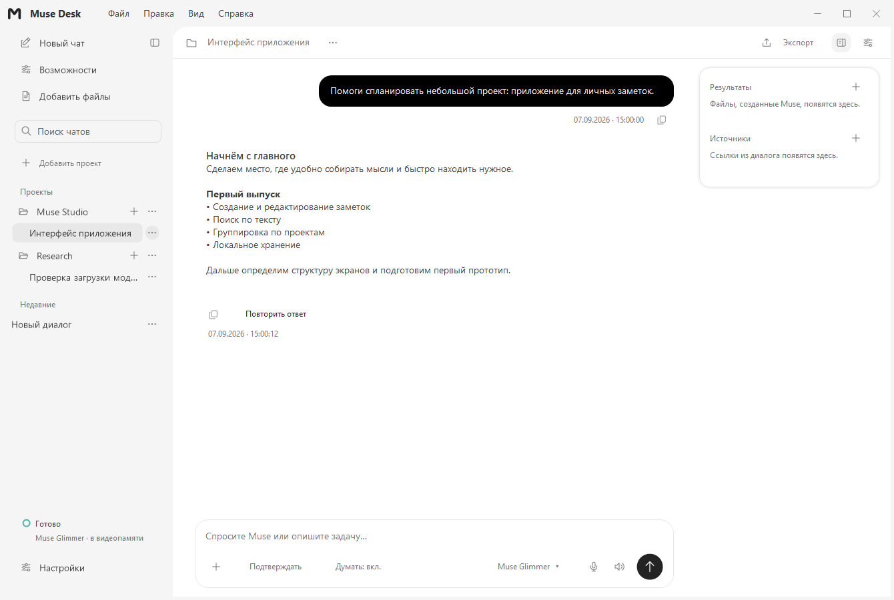
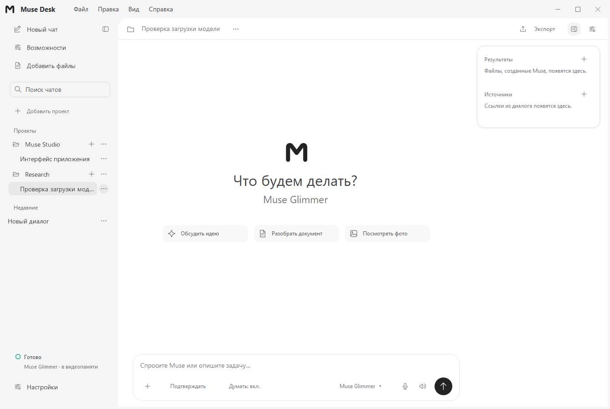
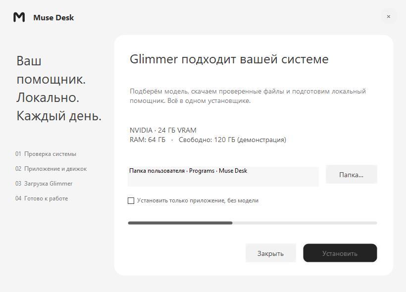

<div align="center">

# Muse Desk
### Ваш помощник. Ваш компьютер. Ваши проекты.

Нативный Windows-клиент для локальных языковых моделей — с проектами, инструментами и спокойным интерфейсом.

[](#установка)
[](https://github.com/magamadovnurid/MuseDesk/actions)
[](https://github.com/magamadovnurid/MuseDesk/releases)

[Скачать установщик](https://github.com/magamadovnurid/MuseDesk/releases) · [Установка](docs/INSTALLATION.md) · [Архитектура](ARCHITECTURE.md) · [Сообщить о проблеме](https://github.com/magamadovnurid/MuseDesk/issues)

</div>



*Настоящий интерфейс приложения с демонстрационным диалогом. На скриншотах нет личной истории пользователя.*

## Большие возможности, локальное исполнение

Muse Desk объединяет привычный опыт современных AI-приложений с локальным запуском LLM. Это **приложение для работы с моделями**, а не новая обученная модель и не обещание равной мощности с любым облачным сервисом. Качество и скорость определяются выбранными весами, контекстом и оборудованием.

После скачивания движка и весов обычный диалог не требует VPN, API-ключа или облачной подписки. Первоначальная загрузка требует доступа к GitHub и Hugging Face; доступность этих сайтов зависит от сети и региона. Веб-инструменты, если вы их включаете, тоже используют интернет.

## Что внутри

| Возможность | Как это работает |
|---|---|
| Проекты и чаты | Выберите существующую папку: её имя становится названием проекта. Создавайте независимые чаты, переносите их между проектами и сворачивайте списки. |
| Локальный помощник | Ответы, рассуждения и работа с поддерживаемыми моделью изображениями. Потоковое появление текста без пересоздания всего диалога. |
| Одна модель за раз | Перед загрузкой выбранной модели приложение запрашивает выгрузку остальных и проверяет состояние движка. Ввод доступен после подтверждения готовности. |
| Работа с файлами | Вложения сохраняются как снимки; результаты и источники собраны в отдельной колонке. |
| Контроль действий | Режимы доступа, запросы разрешений, журнал инструментов, итог выполненной работы и сведения об изменённых файлах. |
| Удобная переписка | Markdown, блоки кода, копирование, экспорт, время отправки и завершения ответа. |
| Продуманный интерфейс | Нейтральные цвета, собственные векторные значки, тонкая прокрутка, единые меню и подтверждения. Поле ввода растёт до трети рабочей области. |
| Windows без Electron | C# / WinForms / .NET Framework 4.8. Приложение и отдельный локальный движок, без браузерной оболочки в основной версии. |



## Установка

**Для пользователя:** скачайте `MuseDesk-Setup.exe` из [Releases](https://github.com/magamadovnurid/MuseDesk/releases) и запустите его. Установщик не требует Git, Node.js или сборки исходников.

1. Он определит Windows, объём RAM, совместимую NVIDIA GPU и свободное место на выбранном диске.
2. Покажет подходящий профиль Glimmer и примерный объём скачивания.
3. После нажатия **«Установить»** распакует приложение, скачает закреплённый движок Ollama и веса с Hugging Face.
4. Проверит размеры и SHA-256 файлов, подключит модель и создаст ярлыки.
5. На первом запуске Muse Desk загрузит модель; дождитесь статуса **«Готово»** перед отправкой промпта.



*Экран установщика с демонстрационными характеристиками. Реальные параметры считываются на компьютере получателя.*

### Автоподбор в первой версии

| Оборудование | Решение установщика |
|---|---|
| Windows x64, NVIDIA ≥24 ГБ VRAM, RAM ≥32 ГБ, Compute Capability ≥7.5, свободно ≥40 ГБ | Glimmer Heretic Q4_K_M + кодировщик изображений Q8_0 |
| Те же условия, NVIDIA ≥32 ГБ VRAM | Glimmer Heretic Q4_K_M + кодировщик изображений F16 |
| Недостаточно памяти, неподтверждённая GPU, AMD или Intel | Только приложение; тяжёлая модель автоматически не скачивается |
| Неподдерживаемая Windows / ARM64 / отсутствует .NET 4.8 | Установка заблокирована с объяснением |

Это консервативная проверка предварительной совместимости, **не стресс-тест и не гарантия стабильности оборудования**. Память нескольких GPU не складывается. Автоподбор ограничен проверяемым каталогом Glimmer, а не случайным выбором любой модели из Hugging Face.

Источники и хеши закреплены в [каталоге установщика](installer/catalog.json). Новая установка использует контекст 8192 и выключенные инструменты; существующая история и настройки не перезаписываются. Установщик не запускает генерацию и не меняет драйверы, BIOS или системные службы.

Подробности, повторная загрузка, диагностика и удаление: **[руководство по установке](docs/INSTALLATION.md)**. Архитектура: **[концепция установщика](docs/INSTALLER-DESIGN.md)**. Подтверждённые результаты: **[отчёт о проверках](docs/VALIDATION.md)**.

## Приватность и ответственность

- Чаты хранятся в `%APPDATA%\MuseDesk\history.json`, веса — в папке установки, в `data\models`.
- Приватный движок слушает `127.0.0.1:11436`, облачные возможности Ollama отключены.
- Интернет-запросы инструментов и действия над файлами зависят от выбранного режима доступа. «Локальный» не означает, что любой разрешённый инструмент работает без сети.
- Удаление проекта из приложения удаляет его чаты после подтверждения; сама рабочая папка и файлы остаются на диске.
- Это независимый проект, не официальный продукт OpenAI. Исходники, сторонние компоненты и модели имеют отдельные условия: [THIRD_PARTY_NOTICES.md](THIRD_PARTY_NOTICES.md).

## Разработка

Windows x64, .NET Framework 4.8 и Windows PowerShell 5.1:

```powershell
git clone https://github.com/magamadovnurid/MuseDesk.git
cd MuseDesk
powershell -NoProfile -ExecutionPolicy Bypass -File .\scripts\build-windows.ps1
powershell -NoProfile -ExecutionPolicy Bypass -File .\scripts\test-windows.ps1
powershell -NoProfile -ExecutionPolicy Bypass -File .\scripts\build-installer.ps1
powershell -NoProfile -ExecutionPolicy Bypass -File .\scripts\test-installer.ps1
```

Приложение: `release\MuseDesk.exe`. Установщик по умолчанию: `%USERPROFILE%\Desktop\Muse Desk Install\MuseDesk-Setup.exe`. Параметр `-OutputDirectory` меняет папку сборки установщика. Обычные тесты не запускают настоящие модели; живые GPU-тесты вынесены отдельно и требуют явного флага `--live`.

Для перерисовки собственных значков нужны Node.js 22+ и `npm ci`; затем `node scripts/create-original-icons.cjs` и `npm run build:icons`. Готовый архив значков уже включён в репозиторий.

<details>
<summary>Структура репозитория</summary>

- `windows-native/` — приложение, компоненты интерфейса и изолированные тесты.
- `installer/` — графический установщик, скрипт установки, закреплённый каталог моделей.
- `scripts/` — сборка, проверки, генерация значков и расширенные сценарии.
- `docs/` — руководство, концепция установщика, публичные скриншоты.
- `experimental/` — отдельные экспериментальные клиенты; в Windows-установщик не включаются.

</details>

## Текущий выпуск

**1.22.0 — первый предварительный выпуск графического установщика.** Включает накопленные изменения интерфейса, проекты и чаты, последовательную загрузку моделей, журналы действий, даты сообщений и адаптивное поле ввода. Автопроверка оборудования и установка без модели тестируются изолированно. Полный аппаратный прогон на разных компьютерах ещё требуется; подтверждённые результаты фиксируются в документации, а не предполагаются по объёму видеопамяти.
