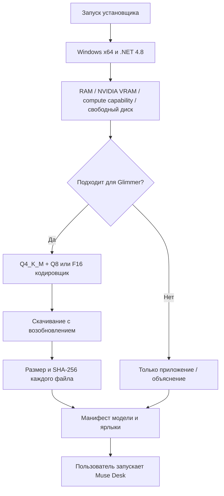

# Концепция и границы установщика

## Принцип

Один небольшой EXE → проверка системы → выбор профиля из закреплённого каталога → проверяемое скачивание → локальная регистрация → запуск по кнопке пользователя.

## Что реализовано

- WinForms-оболочка установки в стиле Muse Desk, этапы, прогресс, диагностика и отмена.
- Одна встроенная полезная нагрузка с приложением. Никакой зависимости от пакета на рабочем столе разработчика, исходников, Git или Node.js на компьютере получателя.
- Консервативный выбор из двух профилей **одной** модели. Нет суммирования VRAM нескольких GPU и скачивания Qwen по умолчанию.
- RAM через CIM, VRAM/Compute Capability через `nvidia-smi`, проверка версии Windows и .NET.
- Фиксированные HF commit IDs, SHA-256 весов и официального архива Ollama. Произвольные URL от пользователя не выполняются.
- Возобновление через curl, обработка ошибок, отмена, сохранение partial-файлов, проверка путей ZIP.
- Прямая регистрация GGUF в приватном хранилище Ollama: blobs, config, params и manifest. Это намеренно не запускает inference при установке.
- Контекст новых установок 8192, инструменты выключены; пользовательские настройки существующих чатов не меняются.
- Изолированные тесты порогов совместимости, контрольных сумм, отмены, zip-slip и установки приложения без модели.

## Почему не выбирать произвольную модель поиском

Один объём VRAM не подтверждает формат, архитектуру, шаблон диалога, поддержку изображений, tool calling и условия распространения. Автоматический выбор должен идти по курируемому каталогу, где каждую модель проверяют отдельно. Источник и ревизия показаны в `installer/catalog.json`; перемещение `main` или `latest` у издателя не меняет установочный набор.

Ближайшее расширение — отдельные проверенные профили для 8/12/16 ГБ, AMD и Intel. Они требуют собственных smoke-тестов, пределов контекста и честного отключения неподдерживаемых возможностей. Эта поддержка пока не заявляется.

## Уровень проверки

Автоматические проверки приложения работают с макетами API, без запуска LLM. Для установщика выполняются синтетические проверки политики и реальная установка app-only в отдельную временную папку. Онлайн-проверка доставки не равнозначна аппаратной проверке генерации. Полный прогон на чистом ПК получателя и матрица NVIDIA 24/32+ ГБ остаются необходимыми перед стабильным выпуском.

Проверяемость «файл скачался и прошёл SHA-256», «Ollama видит манифест» и «модель надёжно отвечает на данном GPU» — три разных уровня. Не показываем последний как подтверждённый только по успешной загрузке. В установщике успех означает установленные проверенные файлы; статус готовности GPU проверяет приложение при первом запуске.

## Отложено

Подпись Authenticode, собственное автообновление, автоматический откат, деинсталлятор, установка .NET/драйверов, Linux/macOS/ARM, альтернативные GPU и компактные модели. Windows SmartScreen может показывать предупреждение для неподписанного EXE.

## Источники

- [Каталог GGUF Heretic](https://huggingface.co/mradermacher/Muse-Glimmer-30B-heretic-GGUF) — файлы, лицензия и хеши закреплённой ревизии.
- [Ollama 0.33.3](https://github.com/ollama/ollama/releases/tag/v0.33.3) — официальный Windows-архив и контрольная сумма.
- [Импорт моделей Ollama](https://docs.ollama.com/import) — общий формат GGUF и локальные модели; прямой манифест в этом проекте фиксирует поведение конкретной версии, а не объявляется стабильным внешним API.
