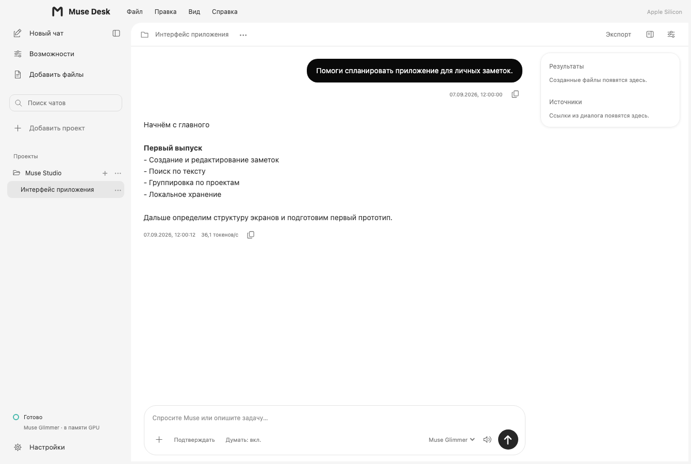
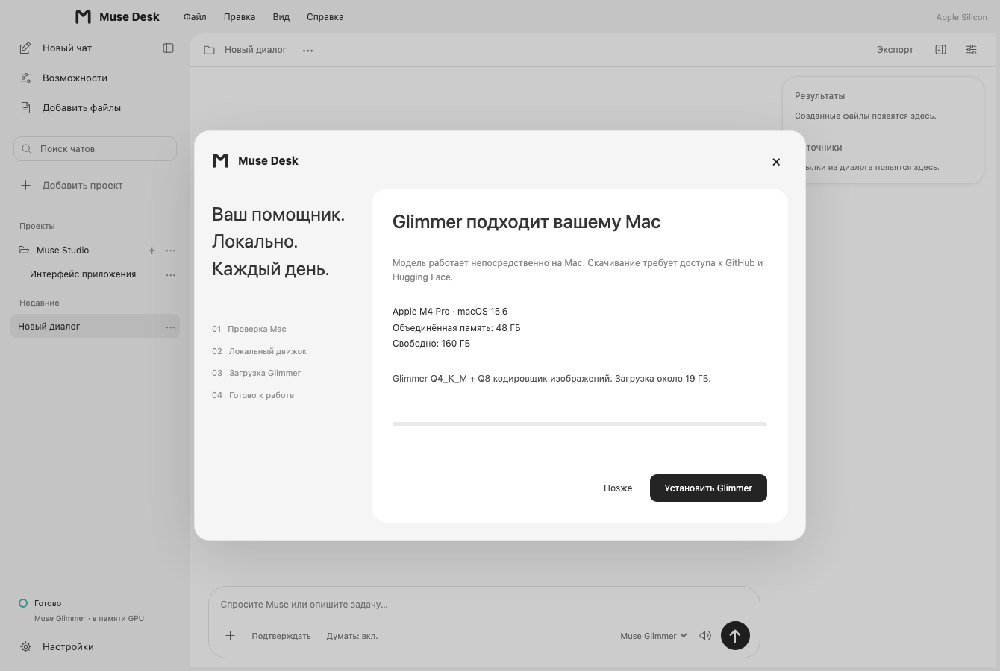

# Muse Desk для Apple Silicon

Mac-версия запускает модель **на самом Mac**. Windows-компьютер, Tailscale и сетевой шлюз для неё не нужны. Интерфейс повторяет основную композицию Muse Desk: проекты слева, переписка в светлой области, результаты и источники справа. Кнопки окна и верхнее системное меню принадлежат macOS.



*Снимок renderer на macOS, демонстрационный диалог.*

## Установить

1. В [Releases](https://github.com/magamadovnurid/MuseDesk/releases) скачайте `MuseDesk-1.23.0-macOS-AppleSilicon.dmg` либо ZIP с таким же названием. Контрольные суммы находятся в `SHA256SUMS.txt`.
2. Откройте DMG и перетащите **Muse Desk** в **Applications**. ZIP содержит то же приложение `.app`.
3. Запустите приложение из Applications. На первом запуске откроется мастер подготовки модели в стиле Muse Desk.
4. Мастер определит процессор, macOS, объединённую память и свободное место. Проверьте показанный профиль и нажмите **«Установить Glimmer»**.
5. Дождитесь скачивания движка, весов и проверки SHA-256. После установки приложение загрузит модель и подтвердит статус **«Готово»**. Только тогда станет доступно поле промпта.

Это предварительная сборка с **ad-hoc подписью**, без сертификата Developer ID и нотариализации Apple. Она не обеспечивает обычного доверенного первого запуска у получателя: Gatekeeper может потребовать явного разрешения пользователя. Для доверенного источника Apple описывает действие «Всё равно открыть» в настройках «Конфиденциальность и безопасность». Глобальное отключение Gatekeeper не требуется. См. [инструкцию Apple](https://support.apple.com/en-ca/guide/mac-help/mh40616/mac). Некоторые управляемые организацией Mac не разрешают такие исключения.

## Какие параметры сканируются



*Настоящий интерфейс мастера на macOS с демонстрационными параметрами 48 ГБ. На компьютере получателя мастер считывает реальные значения.*

| Параметр Mac | Как используется |
|---|---|
| Архитектура `arm64` | Поддерживаются Apple Silicon; Intel и процесс запуска под Rosetta не подходят |
| macOS 14 или новее | Минимальная версия этой сборки |
| Объединённая память | Берётся полный объём RAM через API ОС; это общая память CPU/GPU, а не отдельная NVIDIA VRAM |
| Свободное место | Не менее 40 ГиБ для автоматической установки; частично скачанные компоненты учитываются при повторной попытке |
| 32 / 36 / 48 ГБ памяти | Glimmer Heretic Q4_K_M + кодировщик изображений Q8_0 |
| 64 ГБ и больше | Glimmer Heretic Q4_K_M + кодировщик изображений F16 |
| 24 ГБ и меньше | Glimmer недоступна; мастер не начинает скачивание компонентов или модели |

Для новой установки используется контекст 8192. «Больше 24 ГБ» само по себе не является критерием достаточности: память нужна macOS, другим программам, модели и KV-кэшу. Пороги — консервативная политика допуска, а не измерение быстродействия и не гарантия стабильности. Установщик не меняет системные лимиты Metal, swap, драйверы или настройки безопасности.

Проверяемый каталог — [macos/catalog.json](../macos/catalog.json). Источник весов и ревизия совпадают с Windows-каталогом; движок и конфигурация платформы отдельные. Это GGUF-веса стороннего издателя, а не новая специально обученная Muse Desk модель. Архив Ollama для Darwin закреплён на версии 0.33.3 и проверяется по SHA-256.

## Скачивание и хранение

Первичная загрузка требует доступа к GitHub и Hugging Face. Текстовые веса — 16.94 ГБ; кодировщик изображений — 2.05 либо 3.85 ГБ; движок — около 159 МБ. Интерфейс показывает фактически полученные байты. Отмена останавливает принадлежащий установщику процесс скачивания, сохраняя `.part` для повторного запуска.

Приложение находится в `/Applications/Muse Desk.app`. Данные текущего пользователя находятся в `~/Library/Application Support/Muse Desk/`:

- `history.json` и `.bak` — проекты, чаты и настройки;
- `local/runtime/` — приватный движок;
- `local/models/` — веса и манифесты;
- `local/installation.log` и `local/engine.log` — диагностика;
- `local/downloads/` — кэш движка.

Ollama слушает только `127.0.0.1:11436`, облачные функции отключены. Muse Desk не подключается автоматически к чужому процессу на этом порту. Переключение сначала выгружает резидентные модели приватного движка, ждёт пустого списка и только затем загружает выбранную. Другие приложения на Mac могут независимо пользоваться GPU: это не общесистемная блокировка.

## Функции и границы совместимости

| Функция | Первая macOS-версия |
|---|---|
| Проекты из папок, вложенные чаты, переименование, перенос, удаление | Есть; удаление проекта не удаляет файлы папки |
| Потоковый ответ, рассуждение, время сообщений, скорость, копирование и экспорт | Есть |
| Текстовые вложения и изображения | Есть; до четырёх файлов, обработка изображений локальная |
| Изменяемый контекст и выбор установленной модели | Есть; смена вызывает проверку и перезагрузку |
| Инструменты | Список файлов, чтение/запись UTF-8, shell-команды; каждое действие требует отдельного подтверждения |
| Журнал действий и результаты | Есть, сохраняются с диалогом |
| Озвучивание | Системный синтез речи, если доступен голос macOS |
| Диктовка, захват экрана, все Office/PDF-конвертеры Windows, расширенные режимы разрешений | Полная функциональная эквивалентность пока не заявлена |

Чтение/запись файлов ограничены выбранным проектом и проверяют выход по `..` и символическим ссылкам. **Shell-команда имеет права вашего пользователя и может выйти за пределы проекта**: перед исполнением показывается точная команда и рабочая папка. Инструменты по умолчанию выключены. Изоляция renderer — не macOS App Sandbox всего приложения.

## Сборка и проверка

Сборка выполняется на arm64 runner `macos-15` с Node.js 24 и pnpm 11.19.0:

```sh
cd macos
pnpm install --frozen-lockfile --ignore-scripts
node node_modules/electron/install.js
pnpm test
pnpm test:ui
pnpm build
```

`scripts/test-mac-runtime.cjs` отдельно устанавливает настоящий закреплённый движок и проверяет его версию и пустой список моделей. Он **не скачивает веса и не запускает inference**. CI проверяет ARM64-архитектуру, целостность ad-hoc подписи и запуск упакованного приложения в режиме синтетического UI-теста.

Полный прогон Glimmer на физических Mac с 32/36/48/64+ ГБ, работа Metal под нагрузкой и первый запуск скачанного приложения через Gatekeeper требуют отдельной приёмки. Нельзя считать их пройденными по успешной сборке DMG.

## Удаление

Закройте Muse Desk и перенесите приложение из Applications в корзину. История и веса сохраняются отдельно. Удаляйте каталог Application Support только если намеренно хотите удалить диалоги, настройки и загруженные модели. Рабочие папки проектов находятся вне этого каталога.

## Проверка совместимости перед загрузкой

Начиная с 1.24.4, мастер блокирует загрузку Glimmer на Mac с памятью менее 32 ГБ и при неизвестных параметрах системы. Не путайте объединённую память с местом на SSD. Память проверяется по `hw.memsize` с независимой сверкой; backend повторяет проверку перед скачиванием весов. Уже установленная Glimmer также не запускается на Mac, не проходящем проверку памяти и платформы.

На совместимой macOS приложение можно оставить для просмотра истории без модели. Мастер не предлагает скачивать движок на Mac, не подходящем для Glimmer. Результат проверки с датой и причиной отказа находится в `~/Library/Application Support/Muse Desk/local/hardware-check.json`. Уже скачанные файлы автоматически не удаляются.
